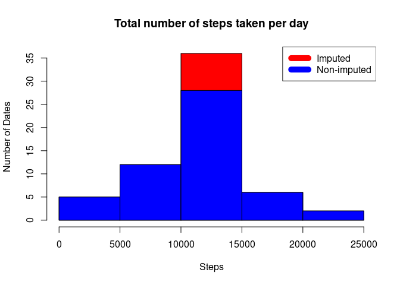

## Loading and preprocessing the data

```r
if(file.exists("activity.zip")){
  unzip("activity.zip")
}
orgdata <- read.csv("activity.csv")
notnas <- !is.na(orgdata$steps)
actdata <- orgdata[notnas,]
```

## What is mean total number of steps taken per day?

```r
dates <- as.Date(actdata$date,format = "%Y-%m-%d")
sumsteps <- aggregate(steps ~ dates,actdata, FUN = sum)
hist(sumsteps$steps,main = "Total number of steps taken per day", xlab ="Steps",ylab = "Number of dates")
```

<!-- -->

Here we have mean and median of the total number of steps taken per day

```r
print(c(summary(sumsteps$steps)[4],summary(sumsteps$steps)[3]))
```

```
##     Mean   Median 
## 10766.19 10765.00
```
## What is the average daily activity pattern?

```r
stepvsint <- aggregate(steps ~ interval, data = actdata, FUN = mean)
plot(stepvsint$interval,stepvsint$steps,type = "l", xlab = "Intervals", ylab = "Steps", main = " Time series plot of the intervals vs the average steps across all days")
```

<!-- -->

Below is the interval contains maximum number of steps across all days

```r
print(stepvsint[which.max(stepvsint$steps),]$interval)
```

```
## [1] 835
```

## Imputing missing values

The total number of missing values in the dataset are

```r
nas <- is.na(orgdata$steps)
print(sum(nas))
```

```
## [1] 2304
```
Creating the new dataset by adding the average values of steps across all intervals  in missing places  

```r
meanforna <- mean(stepvsint$steps)
filledda <- orgdata
filledda[nas,]$steps <- meanforna
```
Average value of steps across all intervals is 37.38

```r
head(filledda)
```

```
##     steps       date interval
## 1 37.3826 2012-10-01        0
## 2 37.3826 2012-10-01        5
## 3 37.3826 2012-10-01       10
## 4 37.3826 2012-10-01       15
## 5 37.3826 2012-10-01       20
## 6 37.3826 2012-10-01       25
```
Histogram of total  number of steps taken per day from new dataset `filledda` created above

```r
dates <- as.Date(filledda$date,format = "%Y-%m-%d")
sumsteps2 <- aggregate(steps ~ dates,filledda, FUN = sum)
hist(sumsteps2$steps,main = "Total number of steps taken per day", xlab = "Steps",ylab = "Number of Dates")
```

<!-- -->

Here we have mean and median of the total number of steps taken per day

```r
print(c(summary(sumsteps2$steps)[4],summary(sumsteps2$steps)[3]))
```

```
##     Mean   Median 
## 10766.19 10766.19
```

## Are there differences in activity patterns between weekdays and weekends?
  Creating the new factor variable `daytype` and adding to the  dataset `filledda`

```r
dates2 <- as.Date(filledda$date,"%Y-%m-%d")
filledda$daytype <- ifelse(weekdays(dates2) =="Sunday" | weekdays(dates2) =="Saturday", "Weekend","Weekday")
```
Time series plot of average `steps` vs `intervals` across weekdays and weekends

```r
library(lattice)
stepvsint2 <- aggregate(steps ~ interval+daytype, data = filledda, FUN = mean)
xyplot(steps~interval|daytype,type = "l",data = stepvsint2 ,xlab = "Intervals", ylab = "Steps")
```

<!-- -->


